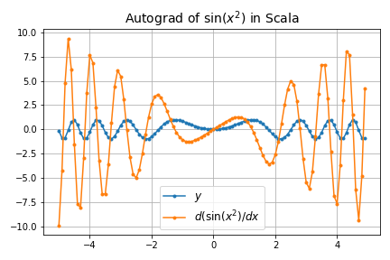
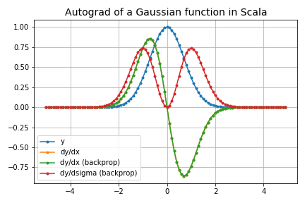
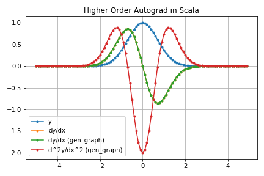

# scagrad

An experimental autograd in Scala

## Overview

They say Scala is a language with both OOP and functional aspects and feels like Rust.
So let's give a try and implement autograd.

## Examples

* Sine wave ($\sin(x^2)$)

* Gaussian

* Higher order autograd

